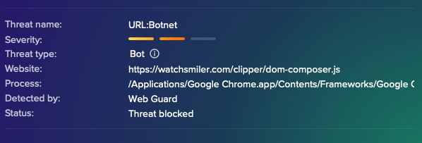
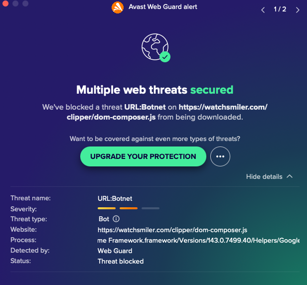
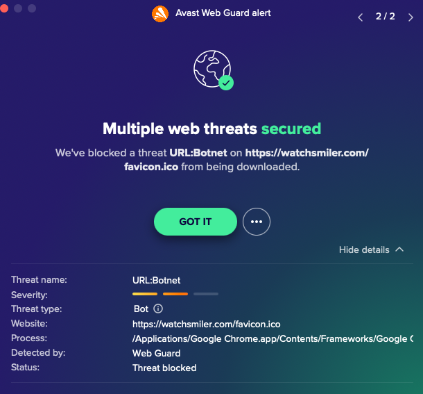

# Deconstruction of a Web Security Botnet Detection

## Malicious JavaScript Payload Analysis (Client-Side)

**Author:** Marcus Badillo
**Discipline:** Web Security / Blue Team / DFIR
**Primary Background:** Frontend Engineering (JavaScript, Browser Runtime)
**Analysis Focus:** Client-side malware delivery & JavaScript reverse engineering
**Status:** Active Investigation

## Executive Summary

During routine user interaction with a public-facing sign-up workflow, a **client-side redirection event** triggered an attempted download of a **malicious JavaScript asset**. Endpoint web security software intercepted the request and classified it as **URL:Botnet**, preventing execution.

The blocked artifact exhibited characteristics consistent with:

- Botnet staging infrastructure
- Malvertising-based JavaScript delivery
- Injection or supply-chain compromise

This repository documents a **Blue Team–aligned investigative workflow** for safely acquiring, deobfuscating, analyzing, and documenting malicious JavaScript delivered through a browser execution context.

All domains, identifiers, and business details have been anonymized.

---

## Scope of Investigation

- Identify how the malicious JavaScript payload was delivered.
- Safely retrieve the script using multiple controlled techniques.
- Deobfuscate the script and extract Indicators of Compromise (IOCs).
- Determine whether the redirect originated from malvertising, server compromise, or injected content.
- Document findings according to Blue-Team and DFIR standards.

---

## Incident Overview

A user navigated to a sign-up form and was redirected to a webpage that attempted to deliver a malicious JavaScript file. Web Security Software blocked the request, preventing execution of the script.

Suspicious URL:

```text
https://xxxxxx.com/clipper/dom-composer.js
```

Source page (referrer, not same as origin using xxxxxx for example only):

```text
https://www.xxxxxx.com/xxxxxx?submissionGuid=XXXX
```

---

## Immediate Red Flags

1. **Unknown hosting domain** not associated with any common CDNs or legitimate script providers.
2. **Suspicious path (“/clipper”)** commonly appearing in malware ecosystems (clipper malware, botnet droppers, malvertising payloads).
3. **Redirect chains** were present and appeared influenced by user-agent and session context.
4. **Possible script injection** on the referring site, suggesting server compromise or malvertising delivery.

---

## Artifacts Included

1. Initial botnet detection alert (3 screenshots)






1. JavaScript payload blocked before execution

2. Secondary blocked resource (favicon request)

These screenshots are treated as primary DFIR evidence artifacts and preserved without modification

---

## Professional Documentation Workflow

### 1. Acquire the Malicious Script Safely

Always use isolated environments such as:

- Virtual machines (Kali, Ubuntu, Windows Sandbox)
- Cloud sandboxes
- Browser + Burp Suite interception
- `curl` usage only inside non-production environments

Never render or execute suspicious JavaScript in a browser on your host machine, even though for malware research, analysts routinely download malicious JS, HTML, EXE, DLL, and more as inert samples.

#### Why You Cannot Rely on curl Alone

Malicious infrastructure often uses polymorphism, meaning payloads change between requests. Differences may depend on:

- User-agent (Chrome vs Firefox vs curl)
- Operating system
- Referrer
- Cookies or session tokens
- Geolocation
- Execution context (browser-required JS)
- Redirect depth
- Professional Rationale
- params

Because of the client–server architecture and HTTP request/response lifecycle, malicious actors generate unique payloads per visitor to evade static detection and signature-based scanning.

#### Retrieving the Closest Browser-Equivalent Payload

Use curl with spoofed headers to more closely replicate a real browser:

```bash
# NOTE: Replace *** with the actual version numbers from your system's browser.
curl -A "Mozilla/*** (Windows NT 10.0; Win64; x64) AppleWebKit/*** (KHTML, like Gecko) Chrome/*** Safari/***" \
  -H "Referer: https://www.xxxxxx.com/" \
  -L \
  -o dom-composer.js \
  "https://xxxxxx.com/clipper/dom-composer.js"
```

-A sets the user-agent to a real Chrome browser

-H Referer: simulates the page that linked to it

-L follows redirect chains (malvertisers often use 302 redirects)

#### 🧠 BUT — professional analysis requires multiple captures

| Capture Method       | Purpose                                            |
| -------------------- | -------------------------------------------------- |
| Browser + Burp Suite | Exact payload delivered to the browser             |
| Curl (spoofed UA)    | Verifies user-agent–specific variations            |
| Curl (default UA)    | Detects filtering of non-browser clients           |
| Sandbox browser      | Detects behavior-triggered or conditional payloads |

And compare these samples to detect:

***Indicators of Conditional Delivery***

1. Payload switching

2. Fingerprinting logic

3. Hidden secondary requests

4. Time-based or session-based variation

5. Evidence of DOM injection or supply-chain compromise

---

### 2. Deobfuscation Workflow

Pretty-print the JavaScript:

```bash
js-beautify dom-composer.js > clean.js
```

parse for obfuscation patterns and Extracting IOCs (Remote domains, Payload URLs, Redirect chains, IP addresses, Base64 blobs & frags, Suspicious DOM manipulation)

```bash
grep -E "eval|atob|unescape|Function|while\(true\)|document\.write|innerHTML" clean.js

```

## References

[JS Obfuscation](https://www.infosecinstitute.com/resources/reverse-engineering/reverse-engineering-javascript-obfuscated-dropper)

## Other tooling

| **Category**                               | **Tool**                                                                             | **Description**                                                                                                                   |
| ------------------------------------------ | ------------------------------------------------------------------------------------ | --------------------------------------------------------------------------------------------------------------------------------- |
| **Script Obfuscators (Bash / PowerShell)** | **[Bashfuscator](https://github.com/Bashfuscator/Bashfuscator)**                     | Framework for generating highly obfuscated Bash scripts; available in Parrot’s package manager.                                   |
|                                            | **[Invoke-Obfuscation](https://github.com/danielbohannon/Invoke-Obfuscation)**       | PowerShell obfuscation module used extensively in red-team operations; can be run on Linux to generate Windows-targeted payloads. |
| **Binary / Executable Protectors**         | **[Hyperion](https://github.com/nullsecuritynet/tools/tree/master/binary/hyperion)** | Runtime encryptor for 32-bit Windows PE executables.                                                                              |
|                                            | **[Shellter](https://www.shellterproject.com/)**                                     | Dynamic shellcode injection and PE file modification tool designed to evade antivirus detection.                                  |
|                                            | **[ProGuard](https://www.guardsquare.com/opensource/proguard)**                      | Open-source optimizer and obfuscator for Java and Android applications.                                                           |
| **Generic Encoding / Obfuscation Methods** | **Base64**                                                                           | Widely used encoding method to conceal strings in scripts. (No repo—standard encoding scheme.)                                    |
|                                            | **[CyberChef](https://gchq.github.io/CyberChef/)**                                   | Web-based “cyber Swiss Army knife” for encoding, decoding, compression, and light obfuscation workflows.                          |
| **Deobfuscation / Analysis Tools**         | **[Ghidra](https://ghidra-sre.org/)**                                                | Full-featured reverse engineering suite with disassembly and decompilation.                                                       |
|                                            | **[radare2](https://github.com/radareorg/radare2)**                                  | Command-line binary analysis and reverse engineering framework.                                                                   |
|                                            | **[olevba](https://github.com/decalage2/oletools/wiki/olevba)**                      | Tool for extracting and detecting obfuscation inside VBA macros in Microsoft Office documents.                                    |
| **Discovery / Package Lookup Methods** | **`apt search obfuscation`** | Or Fuzzy-search for obfuscation-related packages across Debian-based Linux distributions using system repositories. |
